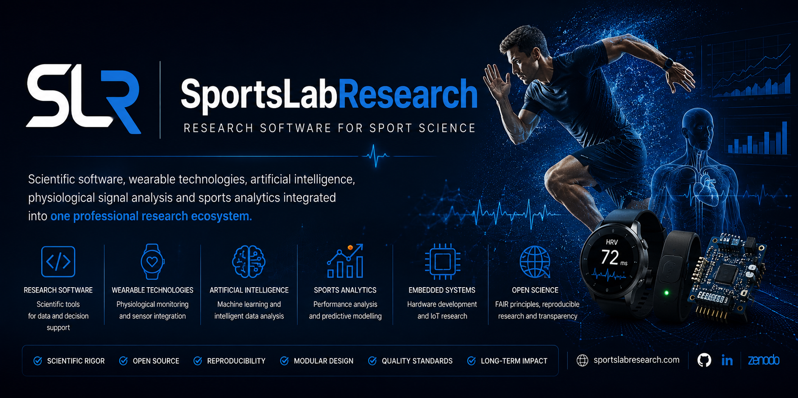

# SportsLabResearch

## Research Software for Sport Science

Scientific software, wearable technologies, artificial intelligence, physiological signal analysis and sports analytics integrated into one professional research ecosystem.

[Explore the portfolio](portfolio.md){ .md-button .md-button--primary }
[View the framework](framework.md){ .md-button }

* :material-application-braces-outline:{ .lg .middle } **6+ Research Projects**

  Scientific software and technology platforms under active development.

* :material-code-tags:{ .lg .middle } **Open Software**

  Versioned, documented and reproducible research tools.

* :material-watch-variant:{ .lg .middle } **Wearable Technologies**

  HRV, GNSS, IMU, heart rate and sensor validation.

* :material-flask-outline:{ .lg .middle } **Scientific Framework**

  One methodology, one quality standard and one research identity.

---

## Research Ecosystem

* :material-code-braces:{ .lg .middle } **Research Software**

  Scientific applications for data processing, statistical analysis, reporting and decision support.

  [Explore software](portfolio.md)

* :material-watch-variant:{ .lg .middle } **Wearable Technologies**

  Physiological monitoring, GPS, IMU, HRV and multimodal sensor integration.

  [View research areas](about.md)

* :material-brain:{ .lg .middle } **Artificial Intelligence**

  Machine learning, computer vision and intelligent sports data analysis.

  [View framework](framework.md)

* :material-chart-line:{ .lg .middle } **Sports Analytics**

  Performance analysis, predictive modelling and scientific visualisation.

  [Explore standards](standards.md)

* :material-chip:{ .lg .middle } **Embedded Systems**

  Arduino, connected sensors and experimental hardware for teaching and research.

  [Explore portfolio](portfolio.md)

* :material-earth:{ .lg .middle } **Open Science**

  FAIR principles, transparent development, versioning and reproducible workflows.

  [View publications](publications.md)

---

## Featured Projects

* **HRV Longitudinal Analyzer**

  Longitudinal analysis of heart rate variability for scientific research and applied monitoring.

  **Status:** Active

  [Project portfolio](portfolio.md)

* **SportsData-Hub**

  Intelligent platform for discovering, collecting and organising sports data sources.

  **Status:** Active

  [Project portfolio](portfolio.md)

* **Edge2Cloud HRV Validator**

  Validation of HRV measurements across mobile, edge and cloud environments.

  **Status:** Active

  [Project portfolio](portfolio.md)

* **SportPy**

  Scientific Python toolkit for sport science analysis and reproducible reporting.

  **Status:** Development

  [Project portfolio](portfolio.md)

* **SportTech GitHub Analyzer**

  Scientific and technical assessment of GitHub repositories related to sports technology.

  **Status:** Development

  [Project portfolio](portfolio.md)

* **Arduino Research Platform**

  Open hardware ecosystem for education, experimentation and sensor-based research.

  **Status:** Development

  [Project portfolio](portfolio.md)

---

## One Scientific Methodology

Every SportsLabResearch project follows a common workflow:

* **1. Research**

  Scientific problem, objectives and evidence base.

* **2. Design**

  Architecture, data model and user workflow.

* **3. Development**

  Modular implementation and version control.

* **4. Validation**

  Reliability, accuracy, agreement and benchmarking.

* **5. Documentation**

  User guides, technical documentation and citation files.

* **6. Publication**

  GitHub, GitHub Pages, Zenodo and scientific dissemination.

[Explore the complete framework](framework.md){ .md-button .md-button--primary }

---

## Quality Principles

* Scientific validation
* Reproducible research
* Modular architecture
* Professional documentation
* Version control
* FAIR principles
* Open Science
* Long-term sustainability

---

## Explore SportsLabResearch

* **About**

  Mission, vision, research lines and development philosophy.

  [Open About](about.md)

* **Portfolio**

  Current scientific software, hardware and technology projects.

  [Open Portfolio](portfolio.md)

* **Framework**

  Common methodology for all SportsLabResearch projects.

  [Open Framework](framework.md)

* **Standards**

  Scientific, technical and documentation quality criteria.

  [Open Standards](standards.md)

* **Publications**

  Research articles, software, datasets and technical reports.

  [Open Publications](publications.md)

* **Contact**

  Collaboration, citation and institutional information.

  [Open Contact](contact.md)

---

## Research Software engineered for the future of Sport Science

**One ecosystem. One methodology. One scientific identity.**

