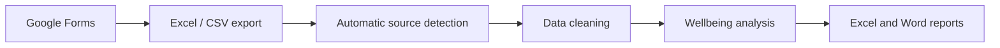

---
hide:
  - toc
---

# BreastCancer Wellbeing Analyzer

Scientific software for importing, organizing and analysing longitudinal wellbeing data in women with breast cancer.

[GitHub](https://github.com/SportsLabResearch/SportsLabResearch-BreastCancer-Wellbeing-Analyzer){ .md-button .md-button--primary }
[Documentation](https://sportslabresearch.github.io/SportsLabResearch-BreastCancer-Wellbeing-Analyzer/){ .md-button }
[Zenodo](https://zenodo.org/search?q=SportsLabResearch-BreastCancer-Wellbeing-Analyzer){ .md-button }

## Main features

-   **Questionnaire data**

    Reads local Excel, CSV and TXT exports produced from Google Forms or synchronized through Google Drive.

-   **Quality control**

    Organizes records, cleans column names and excludes invalid or duplicated output files.

-   **Wellbeing analysis**

    Supports longitudinal analysis of wellbeing indicators collected by the project questionnaire.

-   **Scientific outputs**

    Provides a reproducible basis for Excel and Word reports, tables and figures.

## Workflow

## Scope

The software is intended for research and monitoring workflows. It does not replace clinical assessment, diagnosis or medical decision-making.
